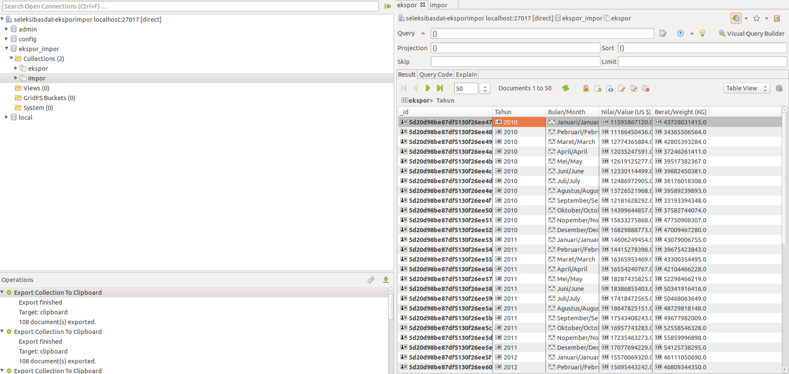

<h1 align="center">
   
  Seleksi 2 Warga Basdat 2019
   
   
</h1>

<h2 align="center">
   
  Data Storing
   
   
</h2>

   
  By : Vivianni - 13517060
   
   

### Description of DBMS
#### MongoDB
- MongoDB is an object-oriented, simple, dynamic, and scalable database
- Many MongoDB management tools available in internet and most of them are easy to use
- Enhance my knowldege about DBMS, as I never used MongoDB before

### Screenshots
Expor Impor Table Database in Studio 3T (MongoDB GUI)

### Reference
- [Studio 3T](https://studio3t.com/)
- [MongoDB](https://www.mongodb.com/)

